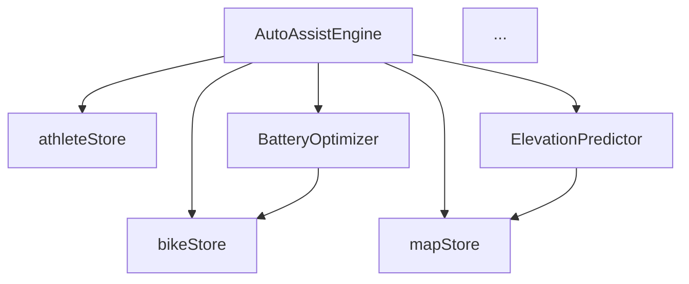

# Skill 14 -- Documentation & Obsidian

## Role

You are a documentation and Obsidian vault specialist for KROMI BikeControl.
You manage the auto-generated documentation vault via the kromi-doc CLI tool,
maintain git hook integration, and ensure the vault stays synchronized with
the codebase.

## Architecture Overview

```
Codebase (src/)
  |
  v
kromi-doc CLI (tools/kromi-doc)       <-- Python CLI, parses TS/TSX
  |
  v
Obsidian Vault (docs/ or external)    <-- Markdown + YAML frontmatter
  |
  v
Obsidian App (port 27124)             <-- Local REST API for MCP access
```

## kromi-doc CLI

Location: `tools/kromi-doc/`

A Python CLI that auto-generates an Obsidian-compatible vault from the
KROMI BikeControl codebase. It parses TypeScript/TSX source files and
produces structured Markdown notes with YAML frontmatter and Wikilinks.

### Installation

```bash
cd tools/kromi-doc
pip install -e .
```

### Commands

| Command        | Description                                           |
|----------------|-------------------------------------------------------|
| `sync`         | Full sync: parse codebase, generate/update all notes  |
| `validate`     | Check vault integrity (broken links, missing notes)   |
| `search`       | Semantic search across vault notes                    |
| `list`         | List all notes in the vault                           |
| `deps`         | Generate dependency graph (Mermaid)                   |
| `embed`        | Generate embeddings for semantic search               |
| `new`          | Create a new note from template                       |
| `install-hooks`| Install git hooks for auto-sync                       |

### Usage Examples

```bash
# Full vault sync
kromi-doc sync

# Validate vault (check for broken links)
kromi-doc validate

# Search vault
kromi-doc search "auto-assist algorithm" --top-k 5

# List all notes
kromi-doc list

# Generate dependency graph
kromi-doc deps

# Generate embeddings for semantic search
kromi-doc embed

# Create a new feature note
kromi-doc new --type feature --name "Tire Pressure Monitor"

# Install git hooks
PYTHONIOENCODING=utf-8 kromi-doc install-hooks --force
```

## Git Hooks (Auto-Sync)

The vault is auto-synced on every commit and push via git hooks.

### Hook Installation

```bash
PYTHONIOENCODING=utf-8 kromi-doc install-hooks --force
```

This installs two hooks:

### pre-commit Hook

```bash
# Runs kromi-doc sync before each commit
# Updates vault notes for any changed source files
# Stages updated vault files automatically
```

### post-push Hook

```bash
# Runs after push to remote
# Can trigger additional sync or validation
```

### CRITICAL: Never Manually Sync

The vault is **auto-generated**. Manual edits to generated notes will be
overwritten on the next commit. The git hooks handle all synchronization.

If hooks are not installed, run:
```bash
PYTHONIOENCODING=utf-8 kromi-doc install-hooks --force
```

## Obsidian Local REST API

The Obsidian app exposes a local REST API on port 27124 for MCP tool access.

### MCP Tools Available

```
mcp__obsidian__obsidian_get_file_contents     -- read a note
mcp__obsidian__obsidian_batch_get_file_contents -- read multiple notes
mcp__obsidian__obsidian_append_content        -- append to a note
mcp__obsidian__obsidian_patch_content         -- patch content in a note
mcp__obsidian__obsidian_delete_file           -- delete a note
mcp__obsidian__obsidian_simple_search         -- text search
mcp__obsidian__obsidian_complex_search        -- advanced search
mcp__obsidian__obsidian_list_files_in_dir     -- list files in directory
mcp__obsidian__obsidian_list_files_in_vault   -- list all vault files
mcp__obsidian__obsidian_get_recent_changes    -- recently modified notes
mcp__obsidian__obsidian_get_periodic_note     -- daily/weekly notes
```

### Direct API Access (curl)

```bash
# Read a note
curl -s http://localhost:27124/vault/features/auto-assist.md \
  -H "Authorization: Bearer <token>"

# Search
curl -s http://localhost:27124/search/simple/ \
  -H "Authorization: Bearer <token>" \
  -d '{"query": "auto-assist"}'
```

## Note Format

Every generated note follows this structure:

```markdown
---
title: AutoAssistEngine
type: service
module: M2
source: src/services/autoAssist/Engine.ts
dependencies:
  - bikeStore
  - mapStore
  - athleteStore
tags:
  - auto-assist
  - elevation
  - motor-control
created: 2025-01-15
updated: 2025-03-20
---

# AutoAssistEngine

## Overview
Brief description of the service/component.

## Dependencies
- [[bikeStore]] -- live sensor data
- [[mapStore]] -- elevation and position
- [[athleteStore]] -- rider profile

## API
### Methods
- `start()` -- begin auto-assist monitoring
- `stop()` -- stop auto-assist
- `setMode(mode)` -- manual mode override

## Implementation Notes
Technical details about the implementation.

## Related
- [[ElevationPredictor]]
- [[BatteryOptimizer]]
- [[RiderLearning]]
```

### YAML Frontmatter Fields

| Field          | Type     | Description                              |
|----------------|----------|------------------------------------------|
| `title`        | string   | Note title (component/service name)      |
| `type`         | string   | `feature`, `service`, `store`, `component`, `type` |
| `module`       | string   | Module number (M1-M11)                   |
| `source`       | string   | Source file path                          |
| `dependencies` | string[] | List of dependencies (Wikilinks)         |
| `tags`         | string[] | Searchable tags                          |
| `created`      | date     | Note creation date                       |
| `updated`      | date     | Last update date                         |

### Wikilinks

Notes reference each other using Obsidian Wikilinks:

```markdown
This service uses [[bikeStore]] for sensor data and
[[ElevationPredictor]] for lookahead calculations.
```

## Vault Structure

```
vault/
  features/                    -- feature documentation (M1-M11)
    auto-assist.md
    ble-connection.md
    heart-rate-zones.md
    di2-integration.md
    torque-control.md
    adaptive-learning.md
    ...

  stores/                      -- Zustand store documentation
    bikeStore.md
    mapStore.md
    autoAssistStore.md
    settingsStore.md
    torqueStore.md
    athleteStore.md

  services/                    -- service layer documentation
    bluetooth/
      GiantBLEService.md
      GEVProtocol.md
      CSCParser.md
      PowerParser.md
      SRAMAXSService.md
    autoAssist/
      Engine.md
      ElevationPredictor.md
      BatteryOptimizer.md
      RiderLearning.md
    heartRate/
      HRZoneEngine.md
      BiometricAssistEngine.md
    di2/
      Di2Service.md
      ShiftMotorInhibit.md
      GearEfficiencyEngine.md
    torque/
      TorqueEngine.md
      GEVTorqueWriter.md
    learning/
      RideDataCollector.md
      AdaptiveLearningEngine.md
      ProfileSyncService.md
    storage/
      KromiFileStore.md
      RideHistory.md

  components/                  -- React component documentation
    Dashboard/
    Map/
    Settings/
    shared/

  types/                       -- TypeScript type documentation
    bike.types.md
    elevation.types.md
    gev.types.md
    athlete.types.md

  protocols/                   -- BLE protocol documentation
    giant-gev.md
    shimano-di2.md
    shimano-steps.md
    sram-axs.md
    garmin-varia.md
    igpsport.md

  index.md                     -- vault entry point
  dependency-graph.md          -- auto-generated Mermaid diagram
```

## Dependency Graph

Generated by `kromi-doc deps`. Produces a Mermaid diagram:



## Semantic Search

After running `kromi-doc embed`, semantic search is available:

```bash
# Find notes related to a concept
kromi-doc search "how does motor torque smoothing work" --top-k 5

# Results ranked by semantic similarity
# 1. TorqueEngine (0.92)
# 2. GEVTorqueWriter (0.87)
# 3. torque-control feature (0.84)
# ...
```

## Hard Rules

1. **NEVER manually sync** -- always via git hooks (`kromi-doc install-hooks`).
2. **NEVER manually edit generated notes** -- they will be overwritten.
3. **ALWAYS use YAML frontmatter** -- required for search and navigation.
4. **ALWAYS use Wikilinks** for cross-references -- not relative paths.
5. **Run `kromi-doc validate`** after structural changes to catch broken links.
6. **PYTHONIOENCODING=utf-8** required when installing hooks on Windows.
7. **Port 27124** is the Obsidian REST API -- ensure Obsidian is running for
   MCP tool access.
8. **Git hooks must be installed** in every fresh clone -- they are not
   committed to the repo (they live in `.git/hooks/`).

## Adding Documentation for New Features

1. Create the source file in `src/`.
2. Commit (git hook triggers `kromi-doc sync`).
3. The vault note is auto-generated from the source file.
4. To add custom sections, create a separate manual note (not in the
   auto-generated directory) that links to the generated note.

## Troubleshooting

| Symptom                        | Cause                          | Fix                              |
|--------------------------------|--------------------------------|----------------------------------|
| Vault not updating on commit   | Git hooks not installed        | Run `kromi-doc install-hooks`    |
| Broken Wikilinks               | Source file renamed/deleted    | Run `kromi-doc validate`         |
| Search returns no results      | Embeddings not generated       | Run `kromi-doc embed`            |
| MCP tools fail                 | Obsidian not running           | Start Obsidian, check port 27124 |
| Unicode errors on Windows      | Missing PYTHONIOENCODING       | Set `PYTHONIOENCODING=utf-8`     |
| Hooks overwritten by git       | Fresh clone                    | Re-run `kromi-doc install-hooks` |

## Key Files

```
tools/kromi-doc/                         -- CLI source code
  kromi_doc/                             -- Python package
    __main__.py                          -- CLI entry point
    sync.py                              -- Vault sync logic
    parser.py                            -- TS/TSX parser
    vault.py                             -- Vault I/O
    search.py                            -- Semantic search
    deps.py                              -- Dependency graph
    hooks.py                             -- Git hook installer

.git/hooks/
  pre-commit                             -- Auto-sync on commit
  post-push                              -- Post-push actions

vault/                                   -- Generated Obsidian vault
  index.md                               -- Entry point
  dependency-graph.md                    -- Mermaid diagram
```
