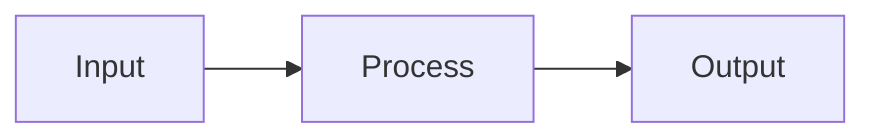

# {{title}}

> One-line summary of what this module does.

**Module:** {{title}}
**Code:** [[Components/...]] · [[Services/.../...]]

---

## Goals

1. Goal 1
2. Goal 2
3. Goal 3

## Architecture

## Components

### Sub-component 1
Description.

### Sub-component 2
Description.

## Database

- [[Database/...]]

## Stores

- [[Stores/...]]

## Pending

- [ ] TODO 1
- [ ] TODO 2

## Related

- [[Arquitectura-Geral]]
- [[MOC]]
